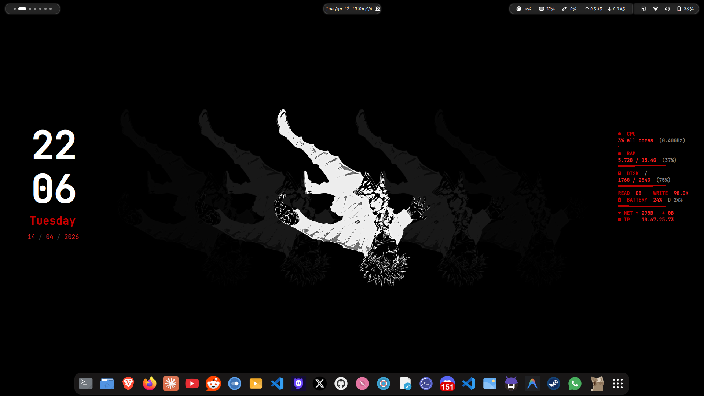

# XR Conky Theme
[](https://github.com/brndnmtthws/conky)
[](https://opensource.org/licenses/MIT)

A minimal, dual-panel Conky configuration designed for desktop integration. XR displays a large clock and date on the left, with system resource monitors aligned on the right. All text is rendered using Nerd Font glyphs for a crisp, icon-driven interface.

## Features

- **Dual‑panel layout** – Clock/date on the left, system stats on the right.
- **Real‑time monitoring** – CPU, RAM, disk usage, disk I/O, battery, and network.
- **Clean typography** – Uses JetBrainsMono Nerd Font for consistent icon and text rendering.
- **Wayland / X11 support** – Configured for X11 by default; toggle `out_to_wayland` for Wayland compositors.
- **Transparent background** – Blends seamlessly with any wallpaper or desktop environment.

## Screenshot



## Requirements

- **Conky** version 1.10 or higher (built with Lua support).
- **JetBrainsMono Nerd Font** installed system‑wide or in `~/.local/share/fonts/`.
- A compositor (e.g., Picom) if transparency is desired.

## Installation

1. **Install Conky**  
   Arch Linux: `sudo pacman -S conky`  
   Debian/Ubuntu: `sudo apt install conky-all`

2. **Install the required font**  
   ```bash
   # Arch Linux
   sudo pacman -S ttf-jetbrains-mono-nerd

   # Manual installation
   mkdir -p ~/.local/share/fonts
   cp /path/to/JetBrainsMonoNerdFontMono-Regular.ttf ~/.local/share/fonts/
   fc-cache -fv
   ```

3. **Clone the repository**  
   ```bash
   git clone https://github.com/uzairdeveloper223/XR.git
   cd XR
   ```

4. **Copy the configuration**  
   ```bash
   mkdir -p ~/.config/conky
   cp XR ~/.config/conky/
   ```

5. **Launch Conky**  
   ```bash
   conky -c ~/.config/conky/XR &
   ```

   To start automatically, add the command above to your window manager's startup file or `~/.xinitrc`.

## Configuration

All visual settings are contained in the `conky.config` table at the top of the file. Key options include:

| Variable          | Description                                 |
|-------------------|---------------------------------------------|
| `gap_x`, `gap_y`  | Window position from the top‑left corner.   |
| `minimum_width`   | Overall width of the Conky window.          |
| `alignment`       | Screen anchor (`top_left`, `top_right`, etc.) |
| `color0` – `color8` | Palette used throughout the theme.        |

Fonts are defined as `font1` through `font5` for different text sizes. Update the family name if you prefer a different Nerd Font.

## Customization

### Changing Icons
All icons are Nerd Font glyphs. Replace any icon by copying a new glyph from the [Nerd Fonts Cheat Sheet](https://www.nerdfonts.com/cheat-sheet) into the `conky.text` section.

### Adjusting the Layout
- **Left panel horizontal position**: Modify the `goto` values on the clock lines (currently `48`, `45`, `40`).
- **Right panel horizontal position**: Change the `goto` values on the system stats lines (currently `1650`).
- **Vertical spacing**: Use `voffset` to increase or decrease the space between elements.

### Network Interface
The network monitor uses `wlp0s20f3` for Wi‑Fi and same for download speed. Replace these with your actual interface names (find them with `ip link`).

## License

This project is licensed under the MIT License. See the [LICENSE](LICENSE) file for details.

## Author

**Uzair Mughal**  
GitHub: [uzairdeveloper223](https://github.com/uzairdeveloper223)  
Email: [contact@uzair.is-a.dev](mailto:contact@uzair.is-a.dev)  
Website: [uzair.is-a.dev](https://uzair.is-a.dev)
